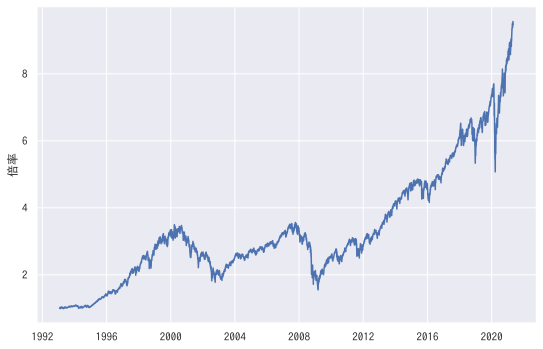
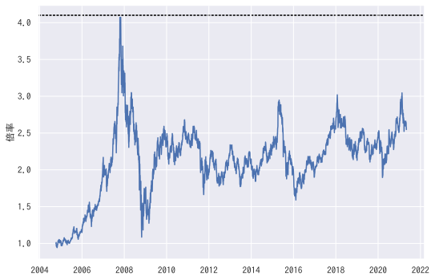

適当に投資をはじめるとどうなるのか？
=========================================

 投資したいけど、何からやれば・・・ 勉強し始めたけど、正直つまらない・・・

こんにちは。ソネスケ(@sonesuke)です。

投資について勉強しようにも、どうすればよいのでしょうか？

そもそも、「とりあえずやってみる」ではだめなのでしょうか？

勉強するにしろ、理由が欲しいですよね。
「ヤバい、これじゃうまくいかない」ってなってはじめて、勉強する気が起きます。

人間には動機が必要です。

しかし、「ヤバい、これじゃうまくいかない」を経験するのは経済的ダメージが大きすぎます。

誰も高い授業料は払いたくないでしょう？

ここでは、筆者が皆様にかわってシミュレーションします。
実際に何が起こるかをみていきたいと思います。

S&P500に投資する！
-----------------------------

アメリカの代表的な投資先 S&P500に投資することを考えてみましょう。

Amazonで、S&P500で検索すると、S&P500を題材にした本がたくさん出てきます。
とても人気のある資産です。これを買っておけば、きっと、大丈夫・・・・・

 S&P500とは、ニューヨーク証券取引所、NASDAQ等に上場している企業の代表的な500銘柄を時価総額で加重平均した指数です。

出だしから、何いってるのかよくわからないですね・・・覚えなくていいです。

 アップル、マイクロソフト、アマゾン、フェイスブック、グーグル、テスラ・・・・

聞いたことないでしょうか？

S&P500は、これらの会社の株を時価総額に合わせて平均した指数です。
アメリカ版のTOPIX(東証株価指数)みたいなものです。
まだわからないですね。

つまり、S&P500は、アメリカ企業が成長すると高くなり、低迷すると低くなる・・・そういう指数ですね。
ざっくり、アメリカの景気を表していると考えてください。

世の中で「S&P500に投資する」って騒いでいるけど、これって指数ですよね？
株でもないものに、どうやって投資すればいいのでしょうか？

まさか、アップルの株と、マイクロソフトの株と、アマゾンの株と・・・・500もの銘柄を買うなんてやってられない・・・・

実は、これらの指数に連動する株というものがあります。その名もETF(上場投資信託)。

ETFは、 **株の一種で、ターゲットの指数と同じ値動きになるように調整してある株の総称** です。

実際に、S&P500と同じ値動きになるように調整してあるETFと、S&P500を比べてみましょう。

.. figure:: ../_images/01_01_fig_ETF.svg
    :alt: ETF

    左がETFの株価、右がS&P500

左右を見比べてみればわかりますが、同じですよね。これが、「同じ値動きになるように調整してある」という意味です。
ものすごく、細かくみると若干のズレはあるのですが、ほぼ同じと考えて差し支えないです。

ETFの対象としている指数は、S&P500以外にも国債、日本株、金・・・と色々なものがあります。

ETFは対象としている指数や、運営会社、上場先の証券取引所によって、さまざまな銘柄あります。

===== =====
銘柄   連動している指数など
===== =====
SPY   S&P500 に連動。アップル、マイクロソフト、アマゾンなどのアメリカ株の組み合わせ。
EWJ   日本株式に連動。トヨタ自動車、ソフトバンク、ソニーなどの日本株の組み合わせ。
FXI   中国株式に連動。テセント、アリババなどの中国株の組み合わせ。
SHY   アメリカの短期国債(1-3年)に連動。
IEF   アメリカの中期国債(7-10年)に連動。
GLD   金相場に連動。
===== =====

それでは、S&P500に連動している **SPY** というETFに投資することにします。
SPYは、この後もよく題材として使うので覚えておいてください。

これは過去のSPYの株価です。

    SPY

まず、このグラフの見方について説明します。

横軸は日付を表します。
つまり、1993年から始まって、2021年ぐらいまであるということを意味します。

縦軸は株価を表します。
しかし株価は、このグラフの最初の日付を、1 としたきにどれくらいの倍率になるかを表します。
つまり、「1993年は、1 だったが、2021年には、9になっている。株価が9倍に値上がりした。」と読みます。

1993年から2021年の28年間で16倍・・・・年利に換算すると8%。(年利は、計算しないと出てきません。)

見事な右肩上がりですね。

では、ココ(2001年)で投資しましょう。

.. figure:: ../_images/01_01_fig_SPY1.svg
    :alt: SPYを買う(1)

    SPYを買う(1)

この後、徐々に株価が下がります。
2001年には、3.8だったのですが、2003年には2・・・・資産が半分になりました・・・・
このあと、3.8に戻ってくるのは2008年・・・約7年。

では、ココ(2012年)で買ったらどうでしょうか？

.. figure:: ../_images/01_01_fig_SPY2.svg
    :alt: SPYを買う(2)

    SPYを買う(2)

この後は、順調に資産が増えっていってそうです。めでたし、めでたし・・・

よくみてみると、半値近くまで下がっている事件が、2003年、2009年、2020年と3回ぐらい起きています。
つまり、 **10年に1回くらい** そういう事件が起きています。

======== =====
日付      事件
======== =====
2003年   2001年に3.8だったものが、2003年には2に。ドットコムバブル崩壊。
2009年   2008年に3.0だったものが、2009年には1.9に。リーマンショック。
2020年   2020年1月に7.8だったものが、2020年3月には5に。コロナショック。
======== =====

つまり、 **始めるタイミングによって、ずいぶん差が出る** ということ。

これがもたらす影響を、もう少し掘り下げてみましょう。

仮に、自分がすでに退職していて、S&P500に投資していた資産を、取り崩しながら生活しているとしましょう。
現時点で、3000株持っていたとします。

今年の生活費として、株式を売却して300万円の現金を作りたいとします。
仮に、1株 1万円としましょう。そうすると売却しなければいけない株数は、

.. math::

  \frac{300万円}{1万円} = 300株

で、300株です。3000株持っているのなら、10年持ちます。

では、1株 5000円だとしましょう。つまり半値です。

.. math::

  \frac{300万円}{5000円} = 600株

600株です。
つまり、半値の時は、より多くの株数を売却しないと同じ金額の現金を作れないことになります。
この場合は、3000株だと5年しか持ちません。

今、株価が半分なので、生活費も半分に・・・・というわけにはいきませんよね。

さきほどは、「自分の資産の大半を株式などで運用し、それで生活している場合」を想定しました。

でも、「自分の資産の大半を株式などで運用しているが、定収入があるので取り崩す必要がない場合」なら、こんな困ったことにはなりません。

つまり、 **自分の経済状況に大きく左右されるということ** です。

いかがだったでしょうか？

 「でも、S&P500だから、こうなんでしょう？他では、違ったことになるのでは？」

という疑問が聞こえてきそうです。
わかりました。S&P500以外のETFもみてみましょう。

日本株に投資する？
-----------------------------

EWJというETFをみてみましょう。これは、日本株に連動するETFです。

.. figure:: ../_images/01_01_fig_EWJ.svg
    :alt: EWJ

    EWJ

1997年ごろに1.1で、その後、下げたり元に戻ったりを繰り返し2021年ごろにやっと上昇に転じます。
もし、退職金を、1997年に全額投資していたら・・・・
株価が半値に近い状態で、資産を取り崩しまくらないといけません。考えるだけでも恐ろしいですね。

ちなみに、バブル崩壊は、もう少し前から始まっているので、これがいわゆる「失われた30年」です。

「日本はね・・・・」と思うかもしれません。

わかりました。いま、勢いのある中国株のETFであるFXIをみてみましょう。

    FXI

・・・・あれ？ 2005年に1だった株価が、2007年の終わりごろに4。その後、4を超えてきません。

最初の2年はすごい勢いだったけど、それ以降はそれほどでも・・・・と思ったのではないでしょうか？

また、2009年には、半値以下に下がっているのがわかります。

いろいろ調べてみるとわかりますが、SPY(S&P500)は半値に下がることはあるけれども、とても儲かるETFだったのです。
人気なのも頷けます。

だけど、半値にさがることもある・・・・なんとかならないでしょうか？

 「リスクの高いものに投資するから、そうなるんでしょう?」

と思いましたか？
では、低リスク代表の国債はどうでしょうか？

国債に投資する・・・
-----------------------------

アメリカの中期国債に連動するETFであるIEFです。

.. figure:: ../_images/01_01_fig_IEF.svg
    :alt: IEF

    IEF

2003年に1だったものが、2020年には1.5ぐらい。20年間で1.5倍。年率にして約2%。

銀行預金よりマシですが・・・・このリターンで「経済的自由」は手に入れられるでしょうか？

しかし、その代わりといってはなんですが、大きく値下がりしていません。

これは、 **ゆっくり着実に成長する資産** だということがわかります。

株と国債・・・・ずいぶん性格が違いますね。

もう少し、詳しく比較してみましょう。

SPY(S&P500)とIEF(アメリカ中期国債)のリーマンショックの時の値動きです。

.. figure:: ../_images/01_01_fig_LEHMAN.svg
    :alt: リーマンショックのときのSPYとIEF

    リーマンショックのときのSPYとIEF

まず、 **SPYが大きく下げている** ことが目を引きます。
2009年3月ごろに株価が半分ぐらいに下がっています。
さすが、リーマンショックといわれるだけの大事件。

IEFの方はどうでしょうか？
2008年から、2012年の間に、1.0から、1.2の間を緩やかに上昇しています。
SPYとは対照的な動きです。

細かいですが、2008年7月から2009年1月の間に10%近く上げています。
IEFは年利2%が普通なので、リーマンショック時は、むしろ急成長したとみるべきでしょう。

ちょうど同じ時期にSPYが急降下しているところもポイントです。

いかがでしょうか？

 「銘柄によって全然違うんだな」

という感想を持っていただければ幸いです。

まとめ
----------------

 「適当に投資をはじめるとどうなるか？」

について、いくつかわかったことがあります。

- 始めるタイミングによって、大きく成果がことなる。
- 投資対象によって、「大儲けできるが大損するもの」「大儲けできないが大損しないもの」がある。
- 長期にわたって投資をしていると、必ず、激しい値動きに巻き込まれる。
- 自分の経済状況によって、どれくらい影響されるかが決まる。

これらを踏まえ、次回以降は下記を考えていこうと思います。

- 自分の経済的状況をどうやって知るのか？
- 大損をどうやって回避すればいいのか？
- どうやって銘柄を選べばいいのか？

興味があれば、お付き合いいただければと思います。

